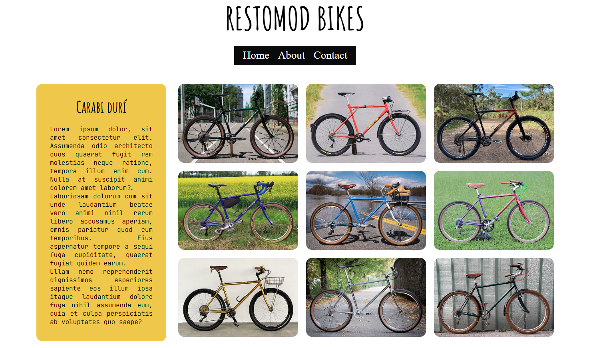
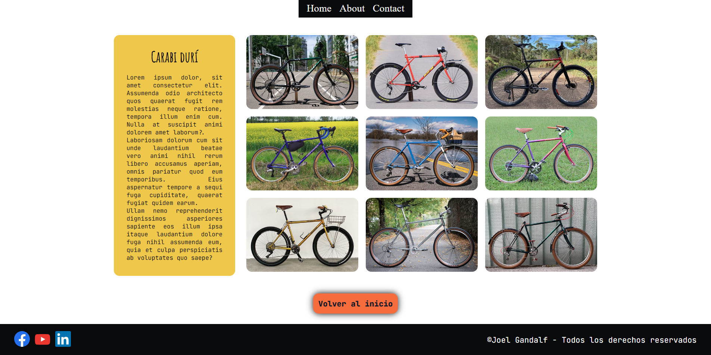
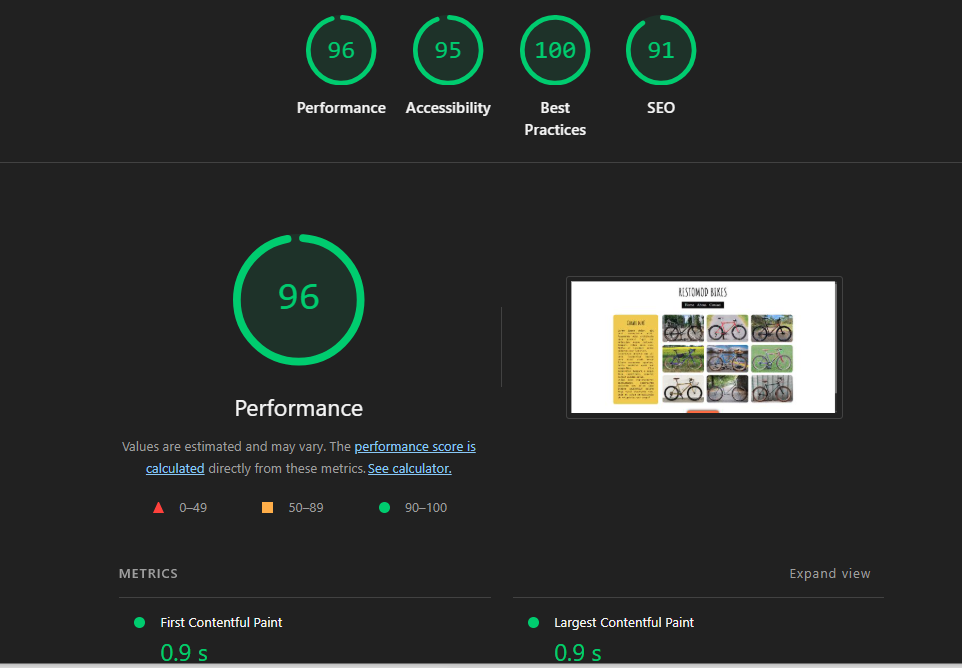
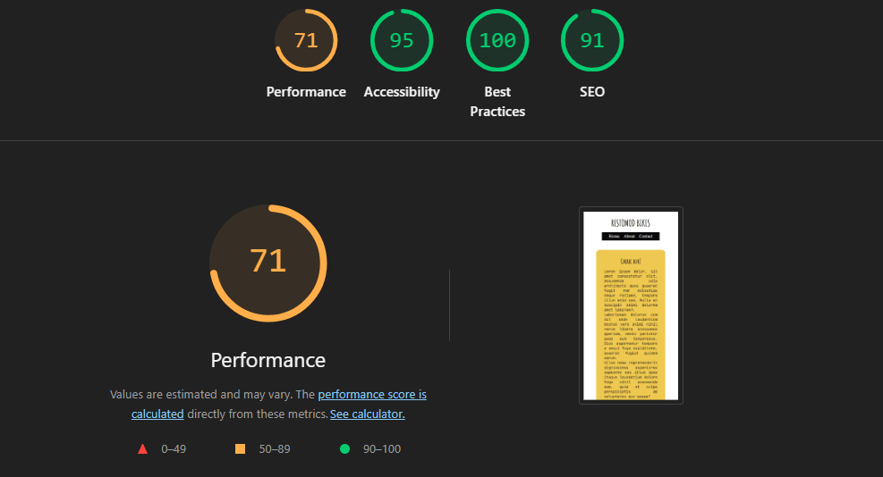
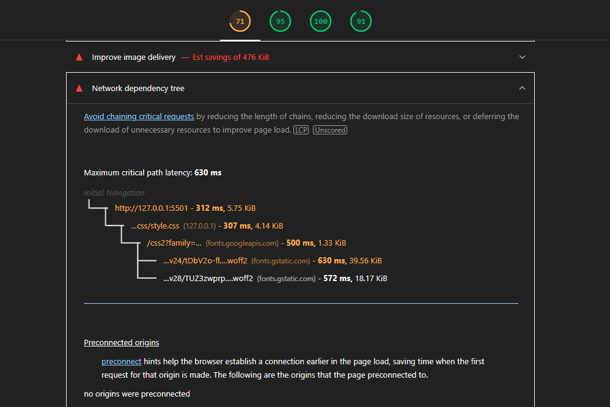

# Your Project Name

> Adaptive and accessible layout

## Description

This project is a blog page for a fictional restomod bike club. It includes menu sections, gallery, and contact links.

## Preview





## Project Structure

```
/
├── index.html          # Main page
├── src/
│   ├── css/
│   │   └── style.css   # CSS styles
│   └── assets/
│       ├── img/        # Project images
│       └── icons/      # Icons
├── .gitignore
└── README.md
```

## Technologies Used

- **HTML5** - Semantic structure
- **CSS3** - Styles and responsive design

## Installation and Execution

### Prerequisites

- A modern web browser (Chrome, Firefox, Edge, Safari)
- A code editor (recommended: VS Code)
- Git installed 

## Testing

- 
- 
- 

### Troubleshooting

- In future projects, do not insert font styles using links. Download font styles and add them using files.
- I still don't know how to solve the cache memory problem.

## Contributors

- **Joel Gandalf Lillo** - [Link to my GitHub](https://github.com/Joel-Gandalf)

## License

This project is under the MIT License - see the [LICENSE](LICENSE) file for more details.

---

If you liked this project, give it a star on GitHub
